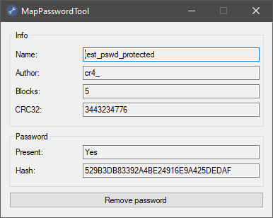

# MapPasswordTool
This tool offers a user-friendly graphical interface that utilizes the [GBX.NET library](https://github.com/BigBang1112/gbx-net/) to remove password protection for map editing in [Trackmania 2020](https://en.wikipedia.org/wiki/Trackmania_(2020_video_game)).

  

For the executable version (.exe file) that you can run directly, please visit the [releases page](https://github.com/SamuelTulach/MapPasswordTool/releases).

## Usage
1. Start the program.
2. Choose the map file you wish to modify.
3. Click the program's only button.
4. Choose a new filename and location to save the modified map.

## License
This project is licensed under [GNU GPL v3](https://www.gnu.org/licenses/gpl-3.0.en.html).